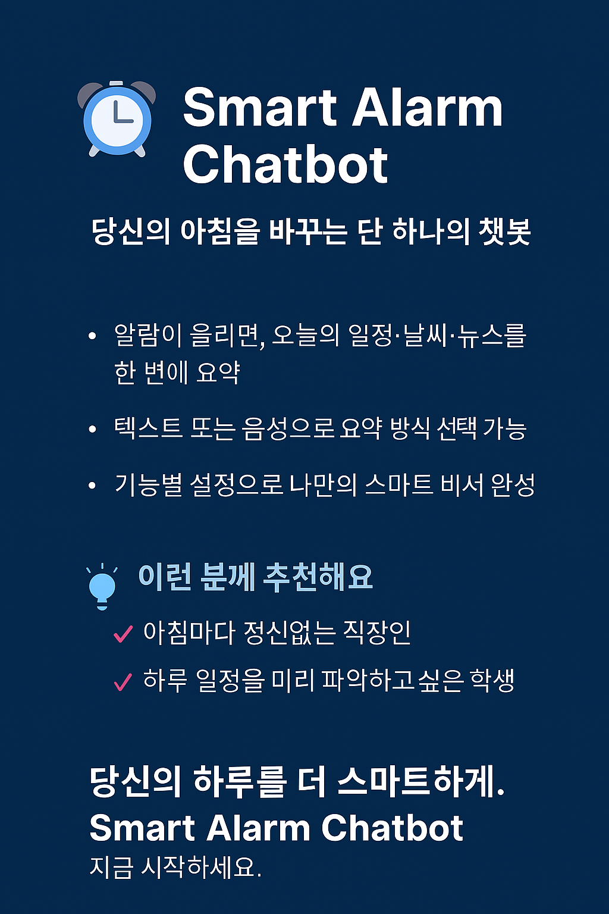
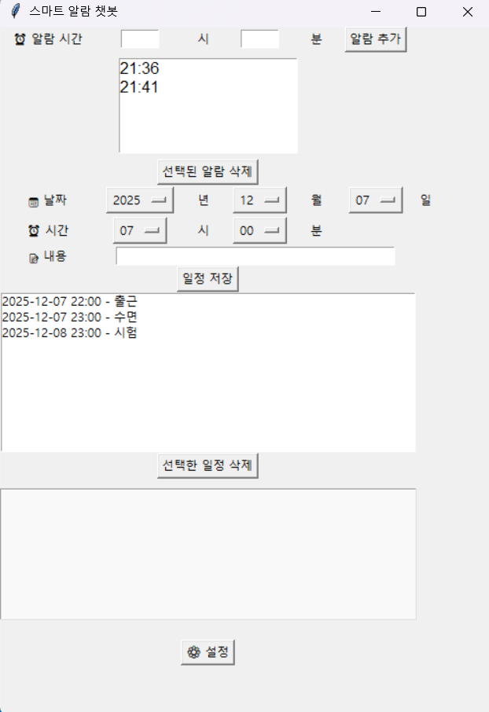

# ⏰ Smart Alarm Chatbot

당신의 아침을 바꾸는 단 하나의 챗봇.

**Smart Alarm Chatbot**은 알람이 울린 순간, 당신에게 꼭 필요한 정보만을 요약해주는 똑똑한 비서입니다. 일정, 날씨, 뉴스까지 — 텍스트로 볼 수도 있고, 음성으로 들을 수도 있어요. 하루를 시작하는 방식, 이제는 선택할 수 있습니다.

---

## 🌟 왜 Smart Alarm Chatbot인가요?

- **알람만 울리는 시대는 끝**: 알람이 울린 후, 오늘의 일정과 날씨, 주요 뉴스까지 한 번에 요약.
- **당신의 방식대로**: 텍스트로 확인하거나, 음성으로 들을 수 있어요. 설정은 간단하게.
- **필요한 정보만 골라서**: 날씨만 보고 싶다면 날씨만, 일정만 보고 싶다면 일정만. 기능별로 자유롭게 설정 가능.

---

## 💡 이런 분들께 추천해요

- 아침마다 정신없는 **직장인**
- 하루 일정을 미리 파악하고 싶은 **학생**

---

당신의 하루를 더 스마트하게.  
**Smart Alarm Chatbot**, 지금 시작하세요.

---

---

## Demo
### 🖼️ Screenshot

### 🎥 Video

> ⚠️ Some demo files are large and may not preview on GitHub.  
> Please click "View raw" to open them directly.

---

## 📚 오픈소스 출처 (Acknowledgements)

이 프로젝트는 다음 오픈소스들을 활용했습니다:

- [Python](https://www.python.org/) – 오픈소스 프로그래밍 언어 (PSF License)
- [Tkinter](https://docs.python.org/3/library/tkinter.html) – Python GUI 라이브러리 (Python 표준 라이브러리)
- [OpenWeatherMap API](https://openweathermap.org/api) – 날씨 데이터 제공 (Creative Commons Attribution-ShareAlike 4.0)
- [Requests](https://docs.python-requests.org/) – HTTP 요청 라이브러리 (Apache 2.0 License)
- [Google Calendar API](https://developers.google.com/calendar) – 일정 데이터 제공 (Google API Terms of Service)
- [gTTS](https://pypi.org/project/gTTS/) – Google Text-to-Speech (MIT License)

라이선스 전문은 [LICENSES](./LICENSES) 디렉토리에 포함되어 있습니다.

## 📄 License
This project is licensed under the MIT License.  
See the [LICENSE](./LICENSE) file for details.
